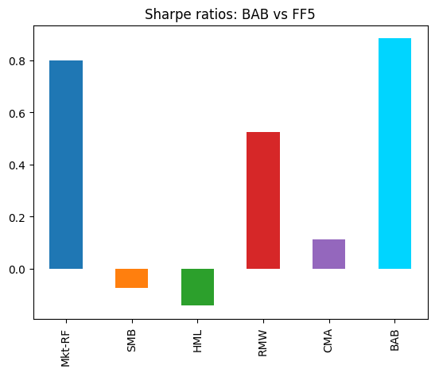
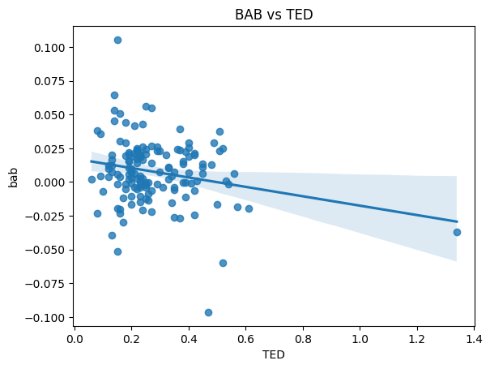

# Betting Against Beta

The utility functions are in `factors.py`. The main notebook is `bab.ipynb`.

This post is a project based off Frazzini & Pedersen's 2013 paper, which demonstrates the Betting against Beta factor - a factor that is long low-beta and short high-beta stocks - to exploit the empirical flatness of the Capital Market Line. I reconstruct the BAB factors and do some basic analysis, learning introductory concepts in factor investing. 

To be honest, it is difficult to do anything innovate over what the paper has already covered, and I think I have enough confidence to turn to trading projects already.

<!-- <br>
<p align='center'>

</p align='center'> -->

# Paper Overview

The paper is based on the quantifying the behavior of certain investors: leverage-constrained investors (e.g pension funds, mutual funds) bid up high-beta assets to harvest greater returns (in accordance with CAPM), causing high-beta assets to be overvalued beyond their intrinsic value and having lower returns. When funding constraints tighten (cannot leverage as much), this behavior lessens, and is less exploitable. Thus, the return of the BAB factor is negatively correlated to funding constraints. 

Another paper by Novy-Marx called _Betting against Betting against Beta_ in 2016 then explained the profitability of BAB was inflated due to the fact the BAB factor portfolios overweight micro and nano-weighted stocks significantly (due to the construction methodology) - which are difficult to trade, and hence very large transaction costs should reduce profitability.


# Factors and Exposures

First, I had to gain some intuition on what these mysterious factors were. From my understanding, a factor is a time series, that is associated with a particular characteristic (a driver of return). These can be constructed in a variety of ways. Given a stock, there exists a loading or exposure that _couples_ the stock to that factor. Then, depending on what factors chosen, a stock's returns can be expressed as the factor returns and their couplings. This extends to a portfolio.

 The CAPM can then be viewed as a single factor model with the market-factor: a value weighted factor of all stocks in an index, with $\beta$ measuring exposure of a stock to the market factor.

From my understanding, given these factors, one can then rebalance/construct portfolios to control the factor exposures: to reduce (risk) or increase (return) exposure to certain factors based on certain investment objectives, using lots of linear algebra and optimization.


# Constructing the BAB Factor

First off, Novy-Marx states that this paper built upon Black's 1972 argument that the capital market line was too flat: empirically, stocks have lower returns than the CAPM suggests. Using returns and beta estimated from 2005-2023:

<br>
<p align='center'>

</p align='center'>


As expected, the $R^2$ is low implying a flat naive line (predicting $\mu$) would be almost an equally good fit. I then calculate the betas according to FP's methodology:

$$\hat{\beta}^{ts}_{i}=\hat{\rho}\frac{\hat{\sigma}_i}{\hat{\sigma}_m}$$

Rather than estimating $\beta$ via a regression directly, FP use the rolling 5Y correlation and 1Y rolling volatilities with 1-day log returns and 3-day log returns respectively. This is to account for non-synchronous trading which is the idea that stocks with different trading frequencies have prices react at different speeds. I'm not entirely sure how this works, however. These betas are shrunk cross-sectionally with the cross-sectional mean.

Then, a low-beta and high-beta portfolio are constructed. The betas are ranked cross-sectionally and a long-short portfolio is formed with stocks above and below median beta with the formula given by Novy-Marx.
<br>
<p align='center'>

</p align='center'>

In other words, rank-weights are formed, taking the ranked distance from median rank divided by the sum of ranked distances. The weights are normalized via leverage by dividing the return or weights by the total portfolio beta at that point in time.

$$r^{BAB}_{t+1}=\frac{1}{\beta^L_t}(r^L_{t+1}-r^f)-\frac{1}{\beta^H_t}(r^H_{t+1}-r^f)$$

So, the long portfolio is overleveraged by a factor of $\sim 1/0.8\approx 1.25$ and the short is underleveraged by a factor of $\sim 1/1.4\approx 0.71$. This is what we get:


<br>
<p align='center'>
    <div style="display: flex; justify-content: center;">
        
        
    </div>
</p align='center'>


Again, because I did not have access to historical index constituents, I use the S&P 'survivors' (never left the index) from 2005. Of course, survivorship bias inflates performance. I also tried to replicate the value-weighted (market cap) BAB factor as per Novy-Marx.


```Python
# function to calculate rolling betas 
def calc_fp_betas(stock_returns, market_returns):
    """apply, column wise"""
    stock_returns_3d = stock_returns.rolling(3).sum().dropna()
    market_returns_3d = market_returns.rolling(3).sum().dropna() 
    
    corr = stock_returns_3d.rolling(252*5).corr(market_returns_3d).dropna()
    stock_vol = stock_returns.rolling(252).std().dropna()
    market_vol = market_returns.rolling(252).std().dropna()
    
    betas = corr.mul(stock_vol,axis=0).div(market_vol,axis=0)
    betas = betas.reindex(stock_returns.index)
    return betas['Adj Close']

# function to apply to each row to get rank-weights
def process_ranked_beta_row(row):
    # Step 1: Rank the betas
    ranked_betas = row.rank()
    # Step 2: Calculate row-wise median rank
    median_rank = np.median(ranked_betas)
    # Step 3: Subtract each rank by the median rank
    rank_minus_median = ranked_betas - median_rank
    # Step 4: Calculate row-wise sum of rank minus median rank. +ve. low beta
    sum_rank_minus_median_above = rank_minus_median[rank_minus_median > 0].sum()
    # Step 5: Calculate row-wise sum of rank minus median rank. -ve. high beta
    sum_rank_minus_median_below = rank_minus_median[rank_minus_median < 0].sum()
    # Step 6: Divide each stock above median rank by the calculated sum from Step 4
    for i in range(len(rank_minus_median)):
        # long low beta
        if rank_minus_median[i] >= 0:
            rank_minus_median[i] /= sum_rank_minus_median_above
        # Short high beta
        if rank_minus_median[i] < 0:
            rank_minus_median[i] /= -1*sum_rank_minus_median_below
    return rank_minus_median
```


# Performance vs Fama-French 5 Factor Model

My objective was to implement the factor construction methodology in code, and having done that, from now on, I switch back to the original BAB factor provided by AQR. 

I then take the Fama-French 5 factor data and regress the constructed BAB factor against them:

<br>
<p align='center'>

</p align='center'>

The $R^2$ is very low, implying majority of variance is not captured by the Fama French factors. The alpha is 57 bps of excess returns. The p-values of the betas are lowest for the CMA and RMW factors, and betas are positive. BAB tilts most towards the investment and profitability factors:


<br>
<p align='center'>
    <div style="display: flex; justify-content: center;">
        
        
    </div>
</p align='center'>
Does this imply that low beta stocks have higher operating profit and and invest more conservatively? This makes sense, since one could argue low beta stocks are from more defensive industries like utilities & consumer staples. Novy-Marx argues the strong returns are overestimated due to transaction costs.


<br>
<p align='center'>
    
</p align='center'>

Given the rank-weights are adjusted via leverage to make BAB have zero beta, it should have a fairly flat slope when regressed against market returns, which checks out.

<br>
<p align='center'>

</p align='center'>

# Overweight in Small Cap Stocks

Novy-Marx explains that the returns are unrealistic as the factor overweights small cap stocks. Using my own S&P BAB, and a scraped market capitalization turnover dataframe from [companiesmarketcap.com](https://companiesmarketcap.com), we can take the total turnover, per market cap decile:

<br>
<p align='center'>
    <div style="display: flex; justify-content: center;">
        
        
    </div>
</p align='center'>


While this looks even, plotting the decile breakpoints shows how much BAB trades in small cap stocks. As per Novy-Marx, there is significant overweight in the lower decile sized stocks which would incur large transaction costs. To adjust for this, they suggest a value-weighted BAB factor.


# Seasonality

I then explore some seasonality patterns by looking at the monthly Sharpe. For whatever reason, there seems to be a strong performance during the midyear period and the first and last months.
<br>
<p align='center'>
    <div style="display: flex; justify-content: center;">
        
        
    </div>
</p align='center'>

# Relation to Funding Constraints via TED Spread    

Lastly, the TED spread is the spread of the 3M Treasury bill and the 3M LIBOR. While it has been discontinued, my understanding is that LIBOR represents the rate banks lend to each other. So a high TED spread indicates banks charge higher rates, which occurs when they expect greater level of risk and want to be compensated fairly. I run a regression on the lagged spread and we see that there is a slightly negative coefficient.

<br>
<p align='center'>
    <div style="display: flex; justify-content: center;">
        
        
    </div>
</p align='center'>

The authors argue that in times of credit risk, constrained investors (e.g pension funds, mutual funds) have less leverage to use. Thus, the extent to which the behavioural pattern occurs (bidding up high beta stocks) is less, and the BAB effect is reduced, leading to a lower return.

# Conclusion

In conclusion, this is just a quick post for me to get some basic exposure to what factors are. But of course, given all these factors, how are they utilized in an investment strategy? This is something I have yet to learn.